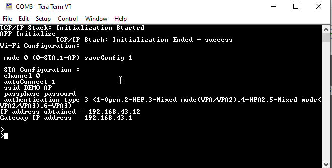
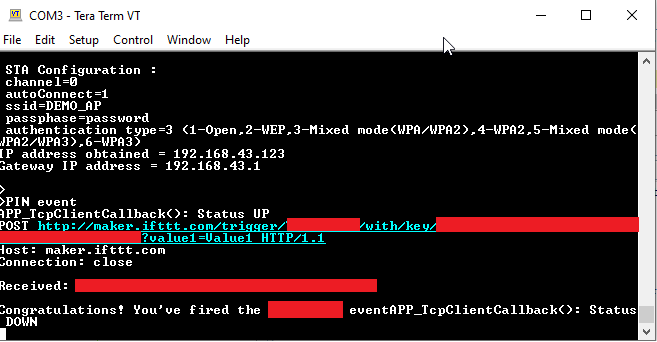

# IFTTT Demo 

This example application demosntrates how we can generate a trigger to IFTTT web platform to make it perform a specific action like sending a mail/ sms etc using an applet.

## Description

IFTTT is short for "If This Then That". IFTTT uses applets for performing specific actions when they are triggered via a connection. This application demonstrates how a user can trigger a pre-existing applet. The application shall come up in STA  mode, and will establish a TLS connection with maker.ifttt.com. It shall send a trigger every time the button (SW1) on the Curiosity Board is pressed.

## Downloading and building the application

To download or clone this application from Github, go to the [top level of the repository](https://github.com/Microchip-MPLAB-Harmony/wireless_apps_pic32mzw1_wfi32e01)

Path of the application within the repository is **apps/ifttt/firmware** .

To build the application, refer to the following table and open the project using its IDE.

| Project Name      | Description                                    |
| ----------------- | ---------------------------------------------- |
| pic32mz_w1_curiosity_freertos.X | MPLABX project for PIC32MZ W1 Curiosity Board |
|||

## Creating an Applet on IFTTT web platform.
IFTTT is a free web platform, and one can create an applet of his/her own. More details on how one can use IFTTT and create their own applets can be found at https://help.ifttt.com/hc/en-us/articles/360021401373-Creating-your-own-Applet

## Setting up PIC32MZ W1 Curiosity Board

- Connect the Debug USB port on the board to the computer using a micro USB cable
- On the GPIO Header (J207), connect U1RX (PIN 13) and U1TX (PIN 23) to TX and RX pin of any USB to UART converter
- Home AP (Wi-Fi Access Point with internet connection)

## Running the Application

1. Open the project and launch Harmony3 configurator.
2. Configure home AP credentials for STA Mode.

    
3. Save configurations and generate code via MHC.
4. Currently application expects the user to create an applet at the IFTTT web platform and configure the relevant details related to the applet in the app.c file. These details will help in creating the trigger which we send to make the applet perform the action.

5.	The user would need to populate the following

| Parameter Name | Default   Value | Description |
|-|-|-|
| IFTTT_EVENT_TYPE | IFTTT_EVENT _BUTTON_PRESS | The IFTTT applet can be triggered in two ways via this application - by pressing the button on the board, or by running a timer and sending the trigger periodically. Currently the application assumes the button press to be the event to trigger the applet. |
| IFTTT_EVENT_PERIOIDC _TIMER_TIMEOUT | 100 sec | This parameter is used for setting the timeperiod in sec, after which a periodic itrigger will be generated. This is valid only when the IFTTT_EVENT_TYPE has been set to IFTTT_EVENT_PERIODIC_TIMER  |
| IFTTT_EVENT | "YOUR_EVENT" | This is a mandatory parameter to be filled in by the user, and is the the 'event' which triggers the applet. This 'event' was used while creating the applet at the IFTTT web platform.  |
| IFTTT_KEY | "YOUR_KEY" | This is a mandatory parameter to be filled in by the user, and is the the 'key' which is generated after the creation of the applet at the IFTTT web platform. |
| IFTTT_NUM_OF_VALUES | 1 | The IFTTT applet can use upto 3 values/ data while performing an action. This parameter indicates the number of values which this application needs to send along with the trigger. |
| IFTTT_VALUE1 | "Value1" | Data that needs to be sent along with the trigger. |
| IFTTT_VALUE2 | "Value2" | Data that needs to be sent along with the trigger. |
| IFTTT_VALUE3 | "Value3" | Data that needs to be sent along with the trigger. |
| IFTTT_USER_CALLBACK | NULL | In case the user wants to processing of some data and based on the result wants to dynamically decide if the trigger needs to be sent or not, he/ she will need to map this parameter to APP_IFTTT_Callback() and implement the action inside this function. This function is expected to return a true if the trigger needs to be sent, else false based on the processing of the data relevant to the user application. For example the user may be implementing a temperature sensor and would want to poll periodically for the temperature but send in a trigger only when the temperature crosses certain threshold. In such a case, implementing this function accordingly can help achive the above objective. Also, there can be requirement that the user needs to also send in the sensed temperature value with the trigger, which can be populated in the 'Value1' and sent.  |
| IFTTT_USER_CALLBACK_CTX | NULL | Callback context/ parameter which will be passed on to APP_IFTTT_Callback(). This could a structure pointer which contains the data to be processed and decide if the trigger needs to be sent. |

6.	Build and program the generated image into the hardware using its IDE
7. Open the Terminal application (Ex.:Tera term) on the computer
8. Connect to the "USB to UART" COM port and configure the serial settings as follows:
    - Baud : 115200
    - Data : 8 Bits
    - Parity : None
    - Stop : 1 Bit
    - Flow Control : None

9.	The Board will connect to Home AP.

    

10. Every time the button/ switch (SW1) is pressed

    
    , 
    
    it shall connect to maker.ifttt.com and send the trigger.

    

11. This Trigger will be received by the ifttt server which will invoke the applet. Let us assume the user created an applet using webhooks which shall 'send an email' as an action. The email could look something like this:

12. Every time a trigger is being sent by the Curiosity Board, the red LED on the board will be ON, and it will go OFF once the trigger request has been successfully trasmitted to IFTTT server. Any new request while the LED is ON will not be honoured. Hence, it is receommended to press the button for a new request only when the red LED has gone OFF.
