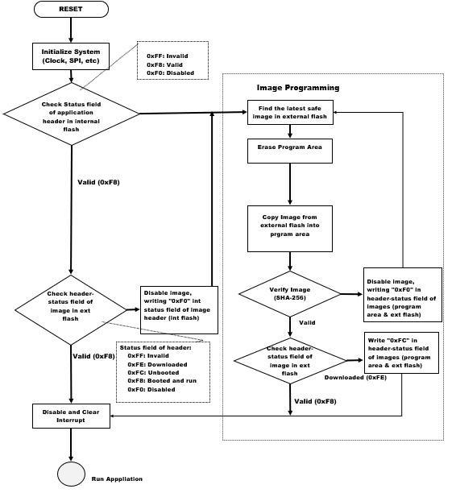

# OTA Boot Loader 

This example acts as loader of OTA image (downloaded using OTA process) to load it to device memory .

## Description

This bootloader project can be used by user to program an image , which is downloaded through OTA process. It is required to build this project first using its IDE (MPLABX) before building OTA application, as the image of the bootloader will be integrated with the "wifi_ota_app_upgrade" application image. 

During boot-up, bootloader will check if any new valid image available in the external flash. If available, it chooses the newly (latest downloaded) available image in the External flash (sst26vf) and program it to Program-Flash area of the device. Bootloader uses SPI protocol to program the image from the external flash. 

If there is no new downloaded image present in the external flash, bootloader will handover the control to current application present in the program-flash area and application will start executing.

The External flash will be configured for 3 slots for storing upto 3 OTA images. Each slot is of size 832KB. Each OTA image will also include header to maintain the image status and SHA-256 Digest signature. Bootloader is having the logic to choose the best suitable valid image, based on the header status of the images and program it to the device. 

## OTA Bootloader framework Architecture

1. Abstraction Model:

    

    - OTA application is responsible to start the OTA process and download new image to Image Store in the external flash (sst26vf).
    - Image downloading is done through HTTP protocol.
    - Bootloader is responsible for the programming process, which loads and copies the best image from Image Store to Program area and jumps to the Application. The bootloader also supports ‘Fail-Safe’ boot scheme which the firmware automatically rolls back if the image has not been run correctly at the previous boot.
    - Image-Store can have multiple images, including the default image for factory reset.

2. During each system boot-up, bootloader checks if it needs to program any image from the external flash. Bootloader goes to program mode, if-

    a) any newly downloaded image present in the external flash, 
   
    b) if the already present image in the program flash is identified as "not safe" during previous boot. 

    There are two conditions :

    - whether the Application Image in Program-Flash area is valid (indicated by the STATUS field, value of 0xF8 in image Header), and
    - whether it has been confirmed that no errors were present during the previous boot (indicated by the STATUS field (of image Header) value of 0xF8 in the original image located in the external flash).
  
    According to bootloader logic if these two conditions are satisfied it will not go to "Program Mode" and the bootloader immediately jumps to the application image present in the program-flash area of the device.

2. If two conditions mentioned in the step 2 are not satisfied, the Bootloader switches to Image Program Mode. In Image Program Mode bootloader follows Image Programming sequence, which finds the highest ranked image in Image-Store(external flash), erases the Program-Flash area and copies the selected image to the Program-Flash area if the image is successfully verified. As the newly downloaded image is set as the highest rank, during the first boot time after the Image-downloading, the Bootloader attempts to load the newly downloaded image at the first try.

    Bootloader choses the highest ranked image to boot. The images are ranked in following order:

    1.  The latest downloaded Image

    2.  The next booted image

    3.  The next known booted image

    4.  Default (Golden) image

3. If the image is not valid, the bootloader invalidates the image by setting “Invalidate” 0xF0 in STATUS field of header present in the external flash and restarts the Image-Programming sequence.

4. If image is verfied successfully, Bootloader updates STATUS field of the image header in external flash-

   a)  checks the header-status field, if it is "Downloaded" (0xFE) updates it as "Unbooted"(0xFC) and jumps to application image.

   b)  if already a validated image (header-status value is "0xF8"), it starts running application image ignoring above mentioned step a).

6. Header structure :

    

7. Flow chart :

    

## Downloading and Generating Bootloader Code

To download or clone this application from Github, go to the [top level of the repository](https://github.com/Microchip-MPLAB-Harmony/wireless_apps_pic32mzw1_wfi32e01)

Path of the project within the repository is **apps/ota_bootloader/firmware**.

To genearte code, refer to the following table and open the project using its IDE.

| Project Name      | Description                                    |
| ----------------- | ---------------------------------------------- |
| ota_bootloader.X | MPLABX project for PIC32MZ W1 Curiosity Board |
|||

## Setting up PIC32MZ W1 Curiosity Board

- Connect the Debug USB port on the board to the computer using a micro USB cable

## Generating BootLoader Code

1.  Open "ota_bootloader" project and launch Harmony3 configurator. Path of the application within the repository is **apps/ota_bootloader/firmware**.
2.  Generate code via MHC.

