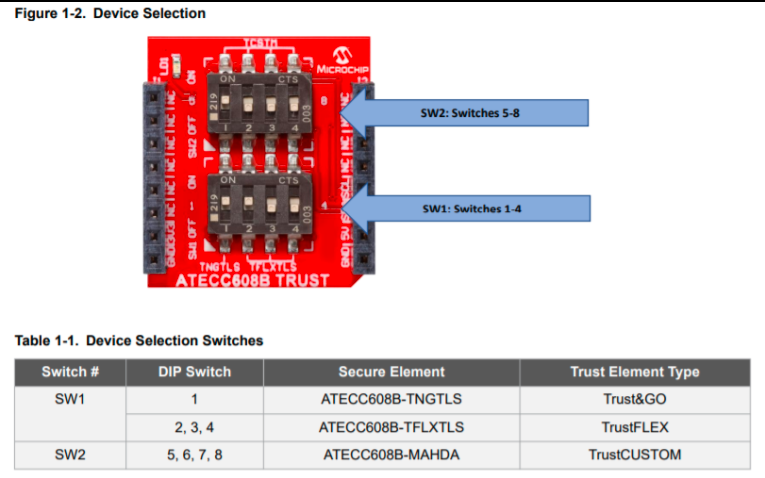

# OTA Boot Loader

This example acts as loader of OTA image (downloaded using OTA process) to load it to device memory .

## Description

This bootloader project can be used by user to program an image , which is downloaded through OTA process. It is required to build this project first using its IDE (MPLABX) before building OTA application, as the image of the bootloader will be integrated with the "wifi_ota_app_upgrade" application image.

During boot-up, bootloader will check if any new valid image available in the external flash. If available, it chooses the newly (latest downloaded) available image in the External flash (sst26vf) and program it to Program-Flash area of the device. Bootloader uses SPI protocol to program the image from the external flash.

If there is no new downloaded image present in the external flash, bootloader will handover the control to current application present in the program-flash area and application will start executing.

**For more details , Please follow documentation provided for Over The Air (OTA) firmware update System Service** 
<!--[link](https://github.com/Microchip-MPLAB-Harmony/wireless_system_pic32mzw1_wfi32e01/tree/master/system/ota/docs)-->

## Securing OTA by verifying Images in Bootloader

We have implemented 2 configurations of OTA Bootloader to perform signature verification of images:
  1.  **In software using Wolfcrypt (ota_booloader_wolfcrypt.x)**
    
        - This configuration uses `wolfcrypt` library, to verify siganture of image. 

            

        - User need to provide public key in the form of array in `pub_key.h` file. Array holds the `DER` encoded public key. The name of the array should be `pubKey[]`.
        
            

        - For development and testing user may use `key2heder.py` python file present in `tools` folder of bootloader project. User follow below steps:
            - Copy the `key2heder.py` file and file containing public key to a particular folder.
            - Use below command from command prompt:
                `python key2header.py [file containing public key]`

                e.g. : python key2header.py ECC_prime256v1.pub
            - `key_header.h` file will be created in the folder. This file contains an array.
            - Copy this array and paste it in `pub_key.h`

  2.  **In Hardware using Trust Flex device (ota_booloader_trustflex.x)**

        -  This configuration requires `trustflex` device for signature verification. For provisioning of trust flex device and other hardware details please follow `Provisioning TrustFlex parts for OTA FW Verification` below.
        
        -  In MHC, `ATECC608` component is configured for signature verification.

            

## Provisioning TrustFlex parts for OTA FW Verification

ATECC608 based Trustflex can be used to perform secure firmware verification. The steps to provision it using TPDS2 is documented here. 

1. Setup TPDS V2

    Setup TPDSV2 following the steps at https://microchipdeveloper.com/authentication:trust-platform-v2

    Make sure that you update TPDS after installation. 

2.  Hardware Setup
    - Plug in the DT100104 click board into the microbus interface.
    - Make sure that you flip all DIP switches other than SW1:2 in click board to OFF position. This will configure the board to expose the TrustFlex device over the I2C Bus.

      

3.  Device Firmware

    TPDS talks to the trust elements using the KitProtocol. So, before using TPDS to provision TrustFlex with the PIC32MZW1 device , we need to flash the [KitProtocol firmware](https://github.com/MicrochipTech/PIC32MZW1_Projects/tree/main/pic32mzw1_kitprotocol) into the dev-board.

    - To update the kit-protocol firmware to use I2C1 instead of the default I2C2 (connected to the onboard TnG module), change HAL_I2C_I2C2 defined in hal_i2c_harmony.h file of the kit protocol project to HAL_I2C_I2C1.
    - When the firmware boots-up, the UART console (15008N1) will display the devices detected.

      

      

4.  Loading the Public Key for FW verification (Provisioning)

    -  Open TPDS  and select ATECC608-TFXTLS configurator under the "Configurators" Tab.

        

    - Select the Firmware Validation (Secure Boot) usecase from the next screen

        

    - Load the public key into Slot 15

        

    - Generate a provisioning package and use it to provision the sample.
      - The attached kit with the trustFlex device mounted on it will be automatically detected and provisioned.
    
    

5.  You can now use the device to verify image signatures in the bootloader.

## Enabling Secure OTA

  By default, `secure ota` option will be disabled. To enable it , user need to follow below steps.
    
  1.  Enable `Secure OTA Functionality` as described in `configure Advances Configuration` section of [link](https://github.com/Microchip-MPLAB-Harmony/wireless_system_pic32mzw1_wfi32e01/blob/master/system/ota/docs/configuration.md).

  2.  Define "SYS_OTA_SECURE_BOOT_ENABLED" in "bootloader.h" of bootloader project. User can simply uncomment line of code in "bootloader.h" as shown in below image :
    
    
  3.  Follow steps describe in `Required steps for Secure-ota` of this document.   

## Generating Signature 

For generating signature please refer `Generating Signature` section of [usage](https://github.com/Microchip-MPLAB-Harmony/wireless_system_pic32mzw1_wfi32e01/blob/master/system/ota/docs/usage.md) manual, which is part of `ota` system component.

## Required steps for Secure-ota

1.  Generate `private key` using command
    `openssl ecparam -genkey -name prime256v1 -noout -out ECC_prime256v1.key`

2.  Generate `public key` using command
    `openssl.exe ec -in ECC_prime256v1.key -pubout -out ECC_prime256v1.pub`

3. In case of `ota_booloader_wolfcrypt.x`, public key should be provided in `pub_key.h` header file , as described above in `Securing OTA by verifying Images in Bootloader` section.

   In case of `ota_booloader_trustflex.x`, please follow `Provisioning TrustFlex parts for OTA FW Verification` as described above.

4. User need to store signature of `Factory image` into system (External flash). This step should be done after factory image is programmed into device and application is running. This is one time job. Please follow steps provided in `Verification of factory image` section of [usage](https://github.com/Microchip-MPLAB-Harmony/wireless_system_pic32mzw1_wfi32e01/blob/master/system/ota/docs/usage.md) manual, which is part of `ota` system component.

5. Create `OTA image` following `Generating the OTA image` section of [usage](https://github.com/Microchip-MPLAB-Harmony/wireless_system_pic32mzw1_wfi32e01/blob/master/system/ota/docs/usage.md) manual, which is part of `ota` system component.

6. Generate `signature` of `OTA` images using private key, as described above in `Generating Signature` of this document. 

7. User need to mention `signature` in Manifest file, please follow `OTA server JSON manifest` section of [usage](https://github.com/Microchip-MPLAB-Harmony/wireless_system_pic32mzw1_wfi32e01/blob/master/system/ota/docs/usage.md) manual, which is part of `ota` system component.

## Using bootloader for Non-secure OTA

User need to undefine macro `SYS_OTA_SECURE_BOOT_ENABLED` in "bootloader.h" of bootloader project to disable `Signature` verfication of images. In this case, only `Digest` verification will be done by bootloader. 

## Disabling File system in Bootloader code

The File system can be disbaled only in the bootloader, `ota_booloader_wolfcrypt.x`. User can disable the File System by undefining the macro `SYS_OTA_FS_ENABLED` in `bootloader.h`.
Also user can enbale the feature, jumping to the start address of the new image downloaded via file downloader, by enabling the macro `SYS_OTA_FILE_JUMP_ENABLE` in  `bootloader.h`. Update the jump address of the new image `APP_IMG_BOOT_ADDR_2` in `ota_config.h` file .This feature is available only with `ota_booloader_wolfcrypt.x`.

## Downloading and Generating Bootloader Code

To download or clone this application from Github, go to the [top level of the repository](https://github.com/Microchip-MPLAB-Harmony/wireless_apps_pic32mzw1_wfi32e01)

Path of the project within the repository is **apps/ota_bootloader/firmware**.

To genearte code, refer to the following table and open the project using its IDE.

| Project Name      | Description                                    |
| ----------------- | ---------------------------------------------- |
| ota_booloader_trustflex.x | MPLABX project for PIC32MZ W1 Curiosity Board using trustflex click board |
| ota_booloader_wolfcrypt.x | MPLABX project for PIC32MZ W1 Curiosity Board using wolfcrypt library |
|||

## Setting up PIC32MZ W1 Curiosity Board

- Connect the Debug USB port on the board to the computer using a micro USB cable

## Generating BootLoader Code

1.  Open "ota_bootloader" project and launch Harmony3 configurator. Path of the application within the repository is **apps/ota_bootloader/firmware**.
2.  In case , `ota_booloader_wolfcrypt.x` to be used, provide public key in `pub_key.h` file, as described above. This step is not required , in case customer wants to use `ota_booloader_trustflex.x`.
3.  By Default , Secure OTA (verifying signture in bootloader) is disabled. To enable it please follow `Enabling Secure OTA` section as described above.  
4. Compile the project using MPLABX
