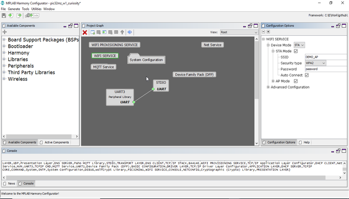
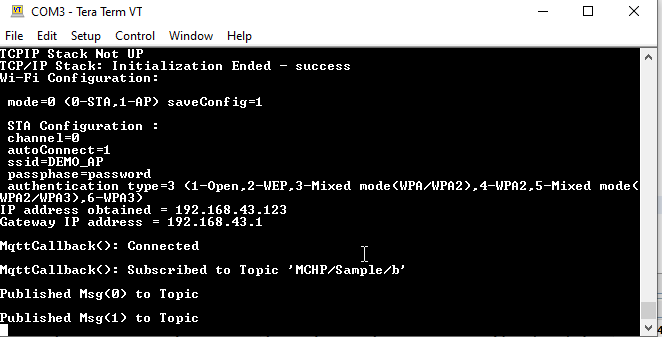

# Paho MQTT Client

This example application acts as a Paho MQTT Client to connect to unsecured MQTT Broker and publishes and subscribes to data on topics.

## Description

This application demonstrates how a user can use the Paho MQTT Client to connect to a MQTT Broker. The system shall run in bare metal mode, and the application shall come up in STA mode. User will need to configure the Wi-Fi credentials for the Home AP and MQTT Service. The default application will try to establish MQTT connection with test.mosquitto.org and publishes message to a topic every 30 sec.

## Downloading and building the application

To download or clone this application from Github, go to the [top level of the repository](https://github.com/Microchip-MPLAB-Harmony/wireless_apps_pic32mzw1_wfi32e01)

Path of the application within the repository is **apps/paho\_mqtt\_client/firmware** .

To build the application, refer to the following table and open the project using its IDE.

|Project Name|Description|
|------------|-----------|
|pic32mz\_w1\_curiosity.X|MPLABX project for PIC32MZ W1 Curiosity Board|
| | |

## Setting up PIC32MZ W1 Curiosity Board

-   Connect the Debug USB port on the board to the computer using a micro USB cable

-   On the GPIO Header \(J207\), connect U1RX \(PIN 13\) and U1TX \(PIN 23\) to TX and RX pin of any USB to UART converter

-   Home AP \(Wi-Fi Access Point with internet connection\)


## Running the Application

1.Open the project and launch Harmony3 configurator.

2.Configure home AP credentials for STA Mode.



3.Currently MQTT Service is configured to run a MQTT Client in unsecured mode to connect to test.mosquitto.org on the mqtt port \(1883\). In case the user wants to change this config, please make the changes in the MQTT Service Module configurations as shown below:


4.Save configurations and generate code via MHC

5.Build and program the generated code into the hardware using its IDE

6.Open the Terminal application \(Ex.:Tera term\) on the computer

7.Connect to the "USB to UART" COM port and configure the serial settings as follows:

```
- Baud : 115200
- Data : 8 Bits
- Parity : None
- Stop : 1 Bit
- Flow Control : None
```

8.The Board will connect to Home AP and then as per the default MQTT Service configuration, it shall connect to test.mosquitto.org and publish messages on the topic 'MCHP/Sample/a' periodically every 30 sec. It also subscribes to topic 'MCHP/Sample/b'.



9.If any third party MQTT Client connects to test.mosquitto.org and subscribes to the topic 'MCHP/Sample/a', it will receive the periodic messages being published by the MQTT Client running on thr PIC32MZW1.


10.In case the Third Party MQTT Client publishes onto the topic 'MCHP/Sample/b', the Paho MQTT Client running on the PIC32MZW1 shall receive the messages being published onto this topic since it has subscribed to it.


