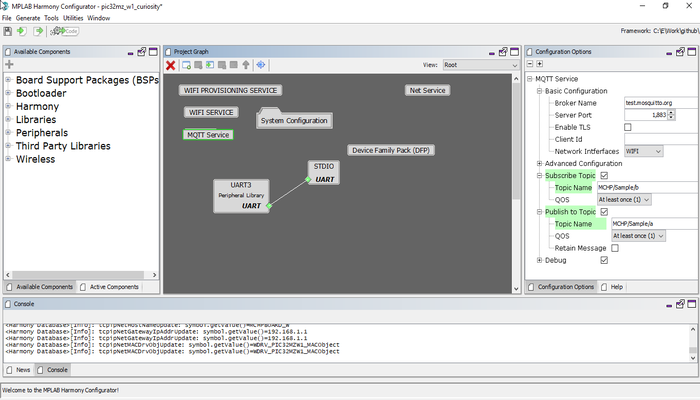
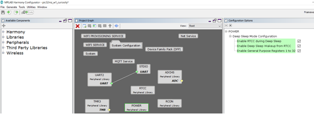

# Paho MQTT Client Power Save 

This example application shows how to use WFI32-IoT device low power modes, Extreme Deep sleep mode (XDS) , Deep sleep mode (DS), Sleep mode,  and Idle mode along with Wi-Fi sleep mode(WSM) and Wi-Fi power off(WOFF). 

## Description

This example application demonstrates below functionalities,
-	How to read room temperature data periodically using WFI32-IoT Board. 
-	Connect to unsecured MQTT Broker using Paho MQTT Client and publishes temperature data to topic every 5 minutes. 
-	The Device enters into configured sleep mode after receiving the publishes acknowledgement from MQTT Broker. 
-	Device can wake-up from sleep modes using RTCC or Button Press(SW1). 

## Downloading and building the application

To download or clone this application from Github, go to the [top level of the repository](https://github.com/Microchip-MPLAB-Harmony/wireless_apps_pic32mzw1_wfi32e01)

Path of the application within the repository is **apps/paho_mqtt_client_power_save/firmware** .

To build the application, refer to the following table and open the project using its IDE.

| Project Name      | Description                                    |
| ----------------- | ---------------------------------------------- |
| wfi32_iot.X | MPLABX project for WFI32-IoT board |
|||

## Setting up WFI32 IOT Board

- Connect the USB port(J200) on the board to the computer using a micro-USB cable.
- Home AP (Wi-Fi Access Point with internet connection)

## Running the Application

1. Open the project and launch Harmony3 configurator.
2. Configure home AP credentials for STA Mode.

3. Currently MQTT Service is configured to run a MQTT Client in unsecured mode to connect to test.mosquitto.org on the mqtt port (1883). In case the user wants to change this config, please make the changes in the MQTT Service Module configurations as shown below:

4.Enable Power peripheral library all the configuration as shown in below Harmony3 configurator project graph.

5.By default, application is configured to run into deep sleep modes \(DS\). User can select desired low power mode of MCU and Wi-Fi using Harmony3 configurator \(MHC\)/MPLAB® Code Configurator \(MCC\) menu.

Note: 
- Configuration to change MCU power save mode is “g_mcuSleepMode = MCU Power save mode” in application in apps_mqtt.c file.
- Configuration to change MCU power save mode is “g_wiFiSleepMode = Wi-Fi power save mode” in application in apps_mqtt.c file.
     

6.	Save configurations and generate code via Harmony3 configurator (MHC) or MPLABX® Code Configurator (MCC).
7.	Build and program the generated code into the hardware using its IDE.
8.	Open the Terminal application (Ex.:Tera term) on the computer.

9. Connect to the "USB to UART" COM port and configure the serial settings as follows:
    - Baud : 115200
    - Data : 8 Bits
    - Parity : None
    - Stop : 1 Bit
    - Flow Control : None

10.	The Board will start reading room temperature data every 5 second using on board temperature sensor.

11.	The Board will connect to AP and then as per the default MQTT Service configuration, it shall connect to test.mosquitto.org and publish room temperature data on the topic ‘MCHP/Sample/a’ after 5 Minute. It also subscribes to topic ‘MCHP/Sample/b’

12.	If any third party MQTT Client connects to test.mosquitto.org and subscribes to the topic ‘MCHP/Sample/a’, it will receive the periodic room temperature data being published by the MQTT Client running on the WFI32-IoT board. The default application will publish periodic room temperature data to a topic every 5 Minutes.

13.	After receiving the publishes acknowledgement from MQTT Broker, device enter into sleep mode (XDS or DS),Sleep or idle mode along with Wi-Fi power save(WSM).

- User can start performing the power measurement when the device prints the above console message “Published Msg Temperature =value in C” and UART console stop printing new messages.
- The information on how to perform the power measurement with the WFI32-IoT board is available at https://microchipsupport.force.com/s/article/How-to-perform-the-low-power-measurement-on-WFI32-IoT-Board
- The information on how to Design Low Power Application with WFI32 board is available at https://microchipsupport.force.com/s/article/How-to-design-low-power-application-using-WFI32-IoT-board

14.In default application, device will wake-up after 1 minute using RTCC as wake-up source.

15.User can press WFI32-IoT Board SW1 button to wake-up device at any time.

- Details of wake-up source supported in low power modes. 
- Supported Wake-up sources: 
    - XDS :
        - EXT INT0(button press using SW1)
    - DS, Sleep, Dream and Idle mode: 
        - EXT INT0(button press using SW1) and RTCC
        - Note: RTCC default application wakeup time is 1 Minute.

Note:

-   XDS and DS wakeup to work,kindly make sure below plib\_clk.c chages are available in the project.

    -   Replace condition,

    -   /*if\(\(!CLKSTATbits.SPLLRDY && RCONbits.POR == 1 && RCONbits.EXTR == 1\) \|\| \(1 == CLKSTATbits.SPLLRDY && 0 == RCONbits.POR && \(\(1 == RCONbits.EXTR\) \|\| \(1 == RCONbits.SWR\)\)\)\)*/

    -   With below condition

    -   if\(\(\(!CLKSTATbits.SPLLRDY\) && \(\(RCONbits.POR == 1 && RCONbits.EXTR == 1\) \|\| \(RCONbits.DPSLP == 1\)\)\) \|\| \(1 == CLKSTATbits.SPLLRDY && 0 == RCONbits.POR && \(\(1 == RCONbits.EXTR\) \|\| \(1 == RCONbits.SWR\)\)\)\)

        -   This Changes will be include in next CSP release.

-   Before Entering to sleep mode, non-wakeup interrupt sources needed to be disabled to achieve desired low power numbers. User can find details of wakeup interrupt sources in the interrupts.c file.

-   User is requested to ensure that app\_mqtt.c , app\_mqtt.h,app.c and app.h files are not overwritten with generated code.

-   Pre-condition for wake-up from sleep modes:

    -   The PMD3 register W24GMD bit should be set When Wi-Fi driver/service functionlity is completely removed from project.

    -   The function WDRV\_PIC32MZW\_PowerSaveModeSet\(WSM/WDS\) should be called before entering the sleep When Wi-Fi driver/service functionlity is enabled.

