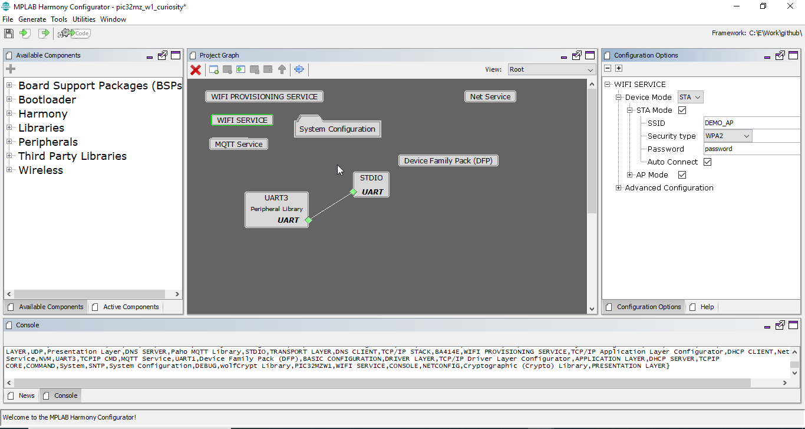
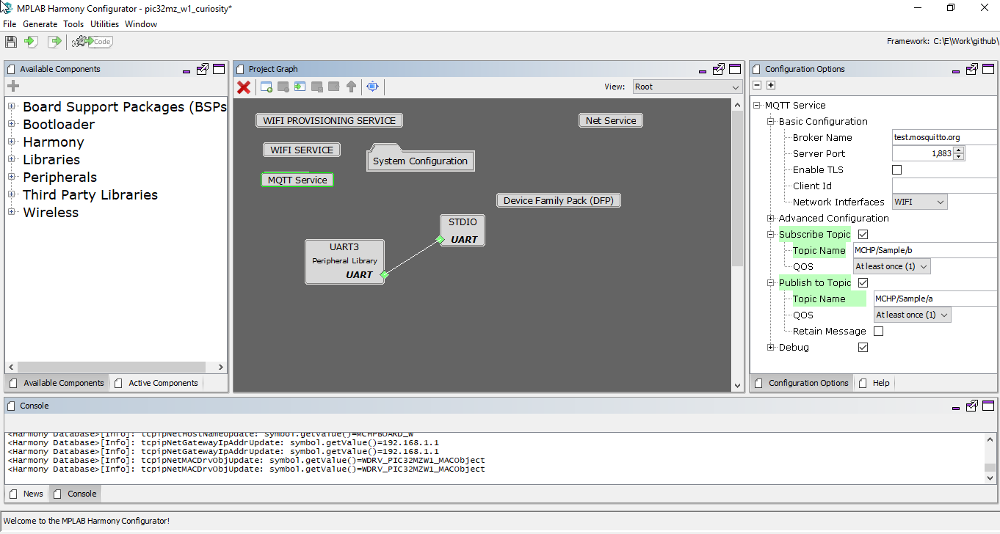

# Paho MQTT Client Power Save 

This example application shows how to use WFI32-IoT device low power modes, Extreme Deep sleep mode (XDS) , Deep sleep mode (DS), Sleep mode,  and Idle mode along with Wi-Fi sleep mode(WSM) and Wi-Fi power off(WOFF). 

## Description

This example application demonstrates below functionalities,
-	How to read room temperature data periodically using WFI32-IoT Board. 
-	Connect to unsecured MQTT Broker using Paho MQTT Client and publishes temperature data to topic every 5 minutes. 
-	The Device enters into configured sleep mode after receiving the publishes acknowledgement from MQTT Broker. 
-	Device can wake-up from sleep modes using RTCC or Button Press(SW1). 

## Downloading and building the application

To download or clone this application from Github, go to the [top level of the repository](https://github.com/Microchip-MPLAB-Harmony/wireless_apps_pic32mzw1_wfi32e01)

Path of the application within the repository is **apps/paho_mqtt_client_power_save/firmware** .

To build the application, refer to the following table and open the project using its IDE.

| Project Name      | Description                                    |
| ----------------- | ---------------------------------------------- |
| wfi32_iot.X | MPLABX project for WFI32-IoT board |
|||

## Setting up WFI32 IOT Board

- Connect the USB port(J200) on the board to the computer using a micro-USB cable.
- Home AP (Wi-Fi Access Point with internet connection)

## Running the Application

1. Open the project and launch Harmony3 configurator.
2. Configure home AP credentials for STA Mode.

    

3. Currently MQTT Service is configured to run a MQTT Client in unsecured mode to connect to test.mosquitto.org on the mqtt port (1883). In case the user wants to change this config, please make the changes in the MQTT Service Module configurations as shown below:

    

4. By default, application is configured to run into deep sleep modes (DS). Power peripheral library configuration details for DS mode as shown in below Harmony3 configurator project graph.
    
5. 	In case, user want to enable only extreme deep sleep modes (XDS) then below Harmony3 configurator modification is needed. 
- As extreme deep sleep modes (XDS) only support wakeup source as EXT INT0(Button Press (SW1)).
- Disable RTCC functionality in Power peripheral library as shown in below Harmony3 configurator project graph
    
6.	For all other supported sleep modes, user doesn’t require any Harmony3 configurator (MHC) changes.

- Supported MCU Power save modes:
    - Extreme deep sleep mode (XDS) (LOW_POWER_DEEP_SLEEP_MODE) and Step 5 above.
    - Deep sleep mode (DS) (LOW_POWER_DEEP_SLEEP_MODE).
    - Sleep mode (LOW_POWER_SLEEP_MODE).
    - Idle mode (LOW_POWER_IDLE_MODE).

    Note: Configuration to change MCU power save mode is “g_mcuSleepMode = MCU Power save mode” in application in apps_mqtt.c file,
 
   
- Supported Wi-Fi Power save modes:
    - WIFI_WSM (Wi-Fi Sleep mode)
    - WIFI_WOFF (Wi-Fi Power OFF)

    Note: Configuration to change MCU power save mode is “g_wiFiSleepMode = Wi-Fi power save mode” in application in apps_mqtt.c file.
     

7.	Save configurations and generate code via Harmony3 configurator (MHC).
8.	Build and program the generated code into the hardware using its IDE.
9.	Open the Terminal application (Ex.:Tera term) on the computer.

10. Connect to the "USB to UART" COM port and configure the serial settings as follows:
    - Baud : 115200
    - Data : 8 Bits
    - Parity : None
    - Stop : 1 Bit
    - Flow Control : None

11.	The Board will start reading room temperature data every 5 second using on board temperature sensor.

12.	The Board will connect to AP and then as per the default MQTT Service configuration, it shall connect to test.mosquitto.org and publish room temperature data on the topic ‘MCHP/Sample/a’ after 5 Minute. It also subscribes to topic ‘MCHP/Sample/b’

    

13.	If any third party MQTT Client connects to test.mosquitto.org and subscribes to the topic ‘MCHP/Sample/a’, it will receive the periodic room temperature data being published by the MQTT Client running on the WFI32-IoT board. The default application will publish periodic room temperature data to a topic every 5 Minutes.

    

14.	After receiving the publishes acknowledgement from MQTT Broker, device enter into sleep mode (XDS or DS),Sleep or idle mode along with Wi-Fi power save(WSM).

    

- User can start performing the power measurement when the device prints the above console message “Published Msg Temperature =value in C” and UART console stop printing new messages.
- The information on how to perform the power measurement with the WFI32-IoT board is available at https://microchipsupport.force.com/s/article/How-to-perform-the-low-power-measurement-on-WFI32-IoT-Board
- The information on how to Design Low Power Application with WFI32 board is available at https://microchipsupport.force.com/s/article/How-to-design-low-power-application-using-WFI32-IoT-board

15.	In default application, device will wake-up after 1 minute using RTCC as wake-up source. 

16.	User can press WFI32-IoT Board SW1 button to wake-up device at any time.

- Details of wake-up source supported in low power modes. 
- Supported Wake-up sources: 
    - XDS :
        - EXT INT0(button press using SW1)
    - DS, Sleep and Idle mode: 
        - EXT INT0(button press using SW1) and RTCC
        - Note: RTCC default application wakeup time is 1 Minute.

