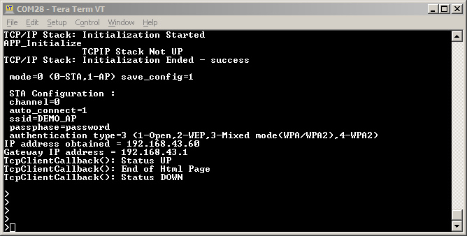

# Secured TCP Client 

The PIC32MZW1 example application acts as a TCP Client to connect to Secured TCP Server and exchange data in a non-blocking manner.

## Description

This application demonstrates how a user can use a TLS TCP  client to connect to a TCP server. The user would need to configure the Wi-Fi credentials for the Home AP and the TLS server details. The default application will try to establish a TLS connection with www.google.com and send a POST request to it.

## Downloading and building the application

To download or clone this application from Github, go to the [top level of the repository](https://github.com/Microchip-MPLAB-Harmony/wireless_apps_pic32mzw1_wfi32e01)

Path of the application within the repository is **apps/tcp_client/firmware** .

To build the application, refer to the following table and open the project using its IDE.

| Project Name      | Description                                    |
| ----------------- | ---------------------------------------------- |
| pic32mz_w1_curiosity_freertos.X | MPLABX project for PIC32MZ W1 Curiosity Board |
|||

## Setting up PIC32MZ W1 Curiosity Board

- Connect the Debug USB port on the board to the computer using a micro USB cable
- On the GPIO Header (J207), connect U1RX (PIN 13) and U1TX (PIN 23) to TX and RX pin of any USB to UART converter
- Home AP (Wi-Fi Access Point with internet connection)

## Running the Application

1. Open the project and launch Harmony3 configurator.
2.	Configure home AP credentials for STA Mode.

3. Currently Net Service is configured to run a TCP Client in Secured mode to connect to www.google.com on the https port (443). In case the user wants to change this config, please make the changes in the Net Service Module configurations as shown below:

4.	Save configurations and generate code via MHC 
5.	Build and program the generated code into the hardware using its IDE
6. Open the Terminal application (Ex.:Tera term) on the computer
7. Connect to the "USB to UART" COM port and configure the serial settings as follows:
    - Baud : 115200
    - Data : 8 Bits
    - Parity : None
    - Stop : 1 Bit
    - Flow Control : None

8.	The device will connect to the Home AP and print the IP address obtained.

9.	The Board will connect to Home AP and then as per the default Net Service configuration, it shall connect to www.google.com and do data exchange:

Note: The secured tcp connection may require the user to modify WolfSSL component settings in MHC depending on the security settings of the site/ server he is trying to access.