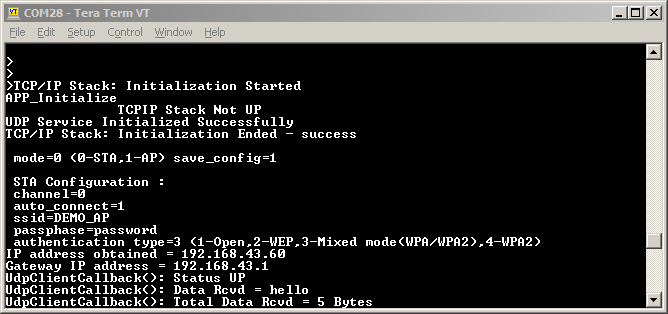

# UDP Client

This example application acts as a UDP Client which connects to a UDP Server and exchanges data in a non-blocking manner.

## Description

This application demonstrates how a user can use a UDP client to connect to a UDP server. The user would need to configure the Wi-Fi credentials for the Home AP and the UDP server details. The default application will send a string to the UDP server. Any standard UDP server can be used to enable the device to connect as a UDP client.

## Downloading and building the application

To download or clone this application from Github, go to the [top level of the repository](https://github.com/Microchip-MPLAB-Harmony/wireless_apps_pic32mzw1_wfi32e01)

Path of the application within the repository is **apps/udp\_client/firmware**

To build the application, refer to the following table and open the project using its IDE.

|Project Name|Description|
|------------|-----------|
|pic32mz\_w1\_curiosity\_freertos.X|MPLABX project for PIC32MZ W1 Curiosity Board|
| | |

## Setting up PIC32MZ W1 Curiosity Board

-   Connect the Debug USB port on the board to the computer using a micro USB cable

-   On the GPIO Header \(J207\), connect U1RX \(PIN 13\) and U1TX \(PIN 23\) to TX and RX pin of any USB to UART converter

-   Laptop/ Mobile \(to run the UDP Server on it\)

-   Access Point


## Running the Application

1.Open the project and launch Harmony3 configurator.

2.Configure Home AP credentials for STA Mode.


3.Currently Net Service is configured to run as UDP Client, which connects to a UDP Server running on port 4444. In case the user wants to change this config, please make the changes in the Net Service Module as shown below:


4.Save configurations and generate code via MHC.

5.Build and program the generated code into the hardware using its IDE.

6.Open the Terminal application \(Ex.:Tera term\) on the computer.

7.Connect to the "USB to UART" COM port and configure the serial settings as follows:

```
- Baud : 115200
- Data : 8 Bits
- Parity : None
- Stop : 1 Bit
- Flow Control : None  
```

8.User can run any third party utility or a udp\_server python script to act as UDP Server running on the Laptop.


9.The Board shall connect to Home AP and then as per the default Net Service configuration, it shall bring up the UDP Client which shall connect to a UDP Server.




Note: TLS Connection is not supported for UDP Client configuration

