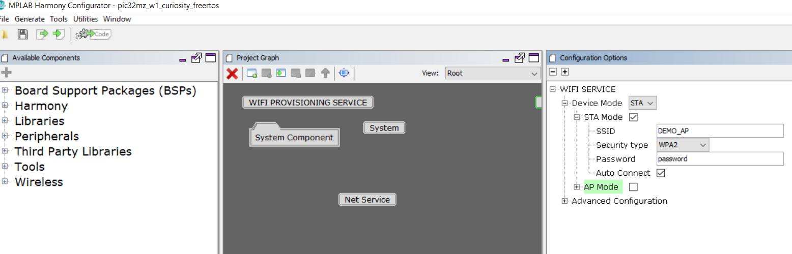
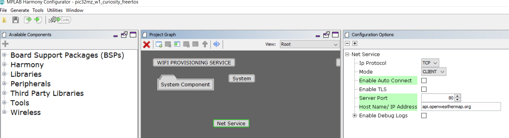
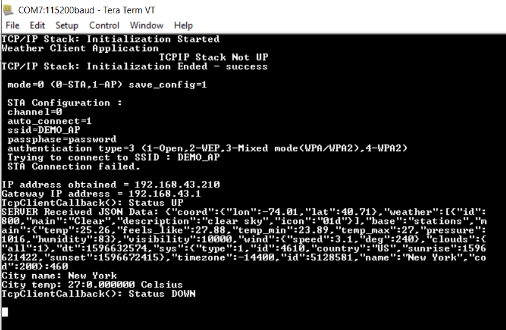

# Weather Client 

This example demonstrates the use of the PIC32MZW1 to retrieve weather
information from a weather server (api.openweathermap.org).

## Description

This application demonstrates how a user can use a TCP client to connect to a Weather server. The user would need to configure the Wi-Fi credentials for the Home AP.The default application will try to establish a TCP Client connection with api.openweathermap.org and send a POST request to it.

## Downloading and building the application

To download or clone this application from Github, go to the [top level of the repository](https://github.com/Microchip-MPLAB-Harmony/wireless_apps_pic32mzw1_wfi32e01)

Path of the application within the repository is **apps/weather_client/firmware** .

To build the application, refer to the following table and open the project using its IDE.

| Project Name      | Description                                    |
| ----------------- | ---------------------------------------------- |
| pic32mz_w1_curiosity_freertos.X | MPLABX project for PIC32MZ W1 Curiosity Board |
|||

## Setting up PIC32MZ W1 Curiosity Board

- Connect the Debug USB port on the board to the computer using a micro USB cable
- On the GPIO Header (J207), connect U1RX (PIN 13) and U1TX (PIN 23) to TX and RX pin of any USB to UART converter
- Home AP (Wi-Fi Access Point with internet connection)

## Running the Application

1. Open the project and launch Harmony3 configurator.
2.	Configure home AP credentials for STA Mode.

3. Currently Net Service is configured to run a TCP Client in non-Secured mode to connect to api.openweathermap.org on the http port (80). In case the user wants to change this config, please make the changes in the Net Service Module configurations as shown below:

4.	Save configurations and generate code via MHC 
5.	Build and program the generated code into the hardware using its IDE
6. Open the Terminal application (Ex.:Tera term) on the computer
7. Connect to the "USB to UART" COM port and configure the serial settings as follows:
    - Baud : 115200
    - Data : 8 Bits
    - Parity : None
    - Stop : 1 Bit
    - Flow Control : None

8.	The device will connect to the Home AP and print the IP address obtained.

9.	The Board will connect to Home AP and then as per the default Net Service configuration, it shall connect to api.openweathermap.org and do data exchange:

