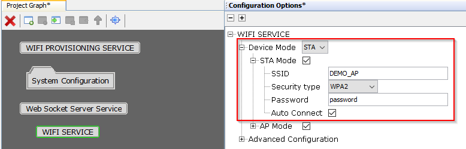
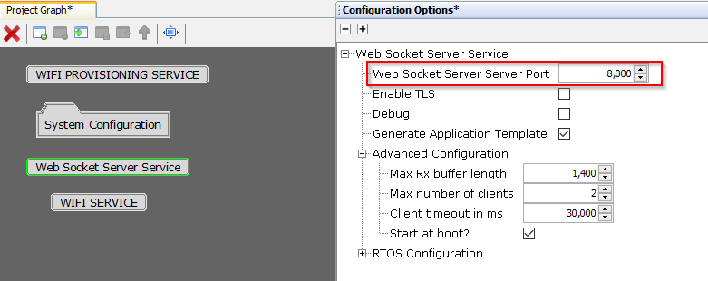
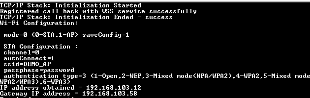
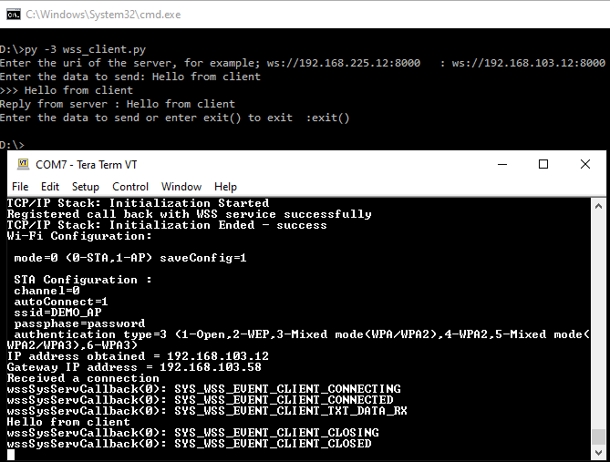

# Web Socket Server

This example application acts as a web socket server enabled enabled with wifi station mode.

## Description

This application demonstrates how a user can enable and utilize the Web Socket Server System service. The system shall run in freertos mode, and the application shall come up in STA mode.

## Downloading and building the application

To download or clone this application from Github, go to the [top level of the repository](https://github.com/Microchip-MPLAB-Harmony/wireless_apps_pic32mzw1_wfi32e01)

Path of the application within the repository is **apps/wss_server/firmware** .

To build the application, refer to the following table and open the project using its IDE.

| Project Name      | Description                                    |
| ----------------- | ---------------------------------------------- |
| pic32mz_w1_curiosity_freertos.X | MPLABX project for PIC32MZ W1 Curiosity Board |
|||

## Setting up PIC32MZ W1 Curiosity Board

- Connect the Debug USB port on the board to the computer using a micro USB cable
- On the GPIO Header (J207), connect U1RX (PIN 13) and U1TX (PIN 23) to TX and RX pin of any USB to UART converter
- Laptop (connect the ethernet cable between laptop and curiosity board)
- Mobile (wifi-interface)

## Running the Application

1. Open the project and launch Harmony3 configurator.
2. Configure the SSID and the credential of the for AP to be connected.

3.	Configure the port for the client connections.

4.	Save configurations and generate code via MHC. 
5.	Build and program the generated code into the hardware using its IDE.
6. Open the Terminal application (Ex.:Tera term) on the computer.
7. Connect to the "USB to UART" COM port and configure the serial settings as follows:
    - Baud : 115200
    - Data : 8 Bits
    - Parity : None
    - Stop : 1 Bit
    - Flow Control : None

8.	The Board will come up in STA mode and it will get connected automatically to the configured AP: 

9. Connect the computer also to the same AP as that of the device and run the python script wss_client/wss_client.py. The script will be used to send data to server. The server will act as a echo server and send the data back to the client.

