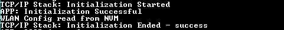

# WLAN AP

This example application shows how to use the PIC32MZW1 WLAN APIs to configure the device in AP mode directly using the WLAN driver APIs.

## Description

This application shows the various commands to be used for AP mode of PIC32MZW1 device. The user can use these commands in configuring the device as AP, start or stop the device as AP, scan operations etc.

## Downloading and building the application

To download or clone this application from Github, go to the [top level of the repository](https://github.com/Microchip-MPLAB-Harmony/wireless_apps_pic32mzw1_wfi32e01) and click


Path of the application within the repository is **apps/wifi\_ap/firmware** .

To build the application, refer to the following table and open the project using its IDE.

|Project Name|Description|
|------------|-----------|
|pic32mz\_w1\_curiosity\_driver.X|MPLABX project for PIC32MZ W1 Curiosity Board|
| | |

## Configuring the Application

### Setting up a regulatory region

The available regulatory domains are - GEN, USA, EMEA, CUST1 and CUST2. One of these regulatory domains must be selected as an active domain. This selection can be done in two ways.

### Using MHC

Figure below shows how to set the regulatory domain in MHC and the path is: TCPIP & SYS\_CONSOLE -\> TCP/IP STACK -\> BASIC CONFIGURATION -\> PIC32MZW1


### Using command

**wlan set regdomain <reg\_domain\_name\>** is the command used to set the regulatory domain. \(wlan set regdomain USA – sets the regulatory domain to USA\).

Note: User can change the regulatory domain using this command only if the current setting is "None" \(cofigured using MHC\)

### Setting up the hardware

The following table shows the target hardware for the application projects.

|Project Name|Board|
|------------|-----|
|pic32mz\_w1\_curiosity\_driver.X|PIC32MZ W1 Curiosity Board|
| | |

### Setting up PIC32MZ W1 Curiosity Board

-   Connect the Debug USB port on the board to the computer using a micro USB cable

-   On the GPIO Header \(J207\), connect U1RX \(PIN 13\) and U1TX \(PIN 23\) to TX and RX pin of any USB to UART converter like [USB UART click](https://www.mikroe.com/usb-uart-click) respectively


### Running the Application

1.Open the Terminal application \(Ex.:Tera term\) on the computer

2.Connect to the "USB to UART" COM port and configure the serial settings as follows:

```
- Baud : 115200
- Data : 8 Bits
- Parity : None
- Stop : 1 Bit
- Flow Control : None
```

3.Build and Program the application project using its IDE

4.Console displays the initialization messages and WLAN config if already saved in NVM



## Supported Commands

|Command|Description|
|-------|-----------|
|wlan config <ssid\> <ssid\_length\> <ssid\_visible\> <channel\> <open/wpa2/wpam/wpa3/wpa3m/wep\> <password\>|Configures the SSID, SSID length, SSID visibility, channel number and the security of the AP that DUT wants to connect. NOTE: Valid channel numbers are in range 1-13|
|wlan ap start|Start the AP|
|wlan ap stop|Stop the AP|
|wlan show devices|The connected devices are shown – MAC and IP addresses are displayed|
|wlan scan <active / passive\> <channel\>|Runs either a active or passive scan \(as per the input\) on the channel number specified|
|wlan save config|Stores the WLAN configurations given in command “wlan config” to flash memory. On restart DUT is started as AP with the credentials stored in flash.|
|wlan set regdomain <reg\_domain\_name\>|Sets the regulatory domain|
|wlan get regdomain <all / current\>|Displays the regulatory domain all – request all regulatory domains; current - request current regulatory domain|
| | |

