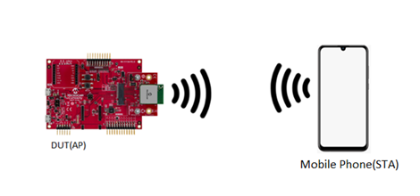
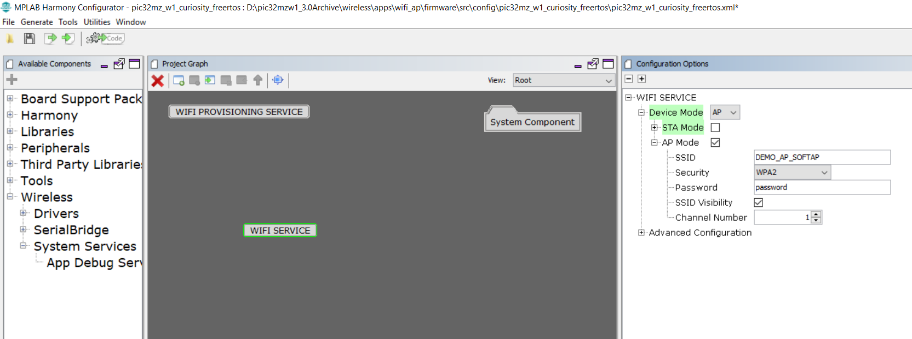
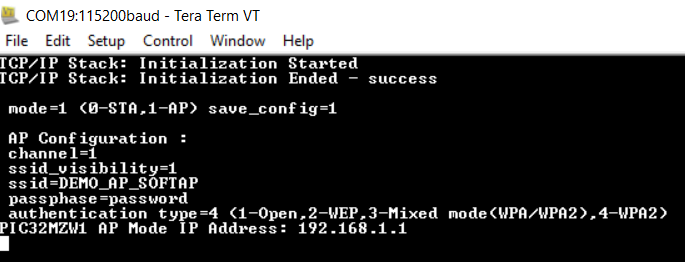
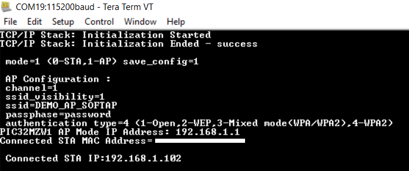
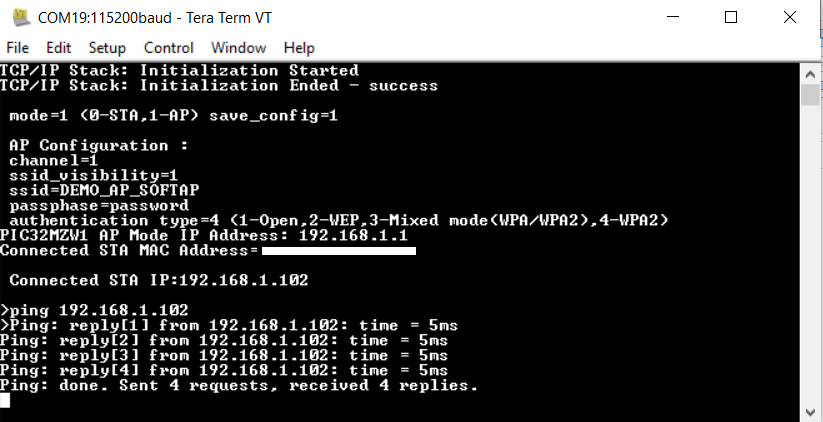

# Wi-Fi Access Point(AP) Mode 

This example application acts as a Wi-Fi Access point(AP) to connect to Laptop/Mobile(STA) and exchange data.

## Description

This application demonstrates how a user can configure the device to operate in SoftAP mode.The device will come up in SoftAP mode and any other device(STA) can connect as a STA to the SoftAP. The third party device should be assigned an IP by the SoftAP.

## Downloading and building the application

To download or clone this application from Github, go to the [top level of the repository](https://github.com/Microchip-MPLAB-Harmony/wireless_apps_pic32mzw1_wfi32e01)

Path of the application within the repository is **apps/wifi_ap/firmware** .

To build the application, refer to the following table and open the project using its IDE.

| Project Name      | Description                                    |
| ----------------- | ---------------------------------------------- |
| pic32mz_w1_curiosity_freertos.X | MPLABX project for PIC32MZ W1 Curiosity Board |
|||

## Setting up PIC32MZ W1 Curiosity Board

- Connect the Debug USB port on the board to the computer using a micro USB cable
- On the GPIO Header (J207), connect U1RX (PIN 13) and U1TX (PIN 23) to TX and RX pin of any USB to UART converter
- Home AP (Wi-Fi Access Point with internet connection)

## Running the Application

1. Open the project and launch Harmony3 configurator.
2. Configure softAP credentials as required.

    

3.	Save configurations and generate code via MHC 
4.	Build and program the generated code into the hardware using its IDE
5. Open the Terminal application (Ex.:Tera term) on the computer
6. Connect to the "USB to UART" COM port and configure the serial settings as follows:
    - Baud : 115200
    - Data : 8 Bits
    - Parity : None
    - Stop : 1 Bit
    - Flow Control : None

7. The device will boot in softAP mode.

    

8. Connect to the softAP from a laptop or a Mobile Phone.
   User may have to enter password on laptop or mobile phone for connecting to device SoftAP based on security type selected in MHC.
   As soon as the client connects, the device will print the IP address leased to it 

    

9. From DUT, user can ping the connected device. 

    

