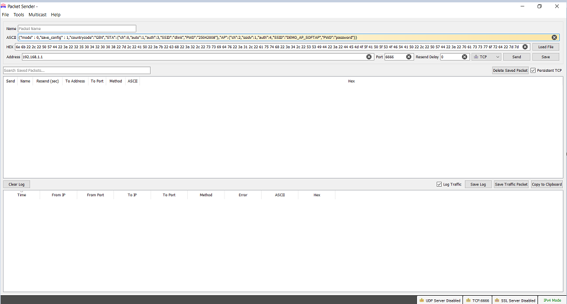

[](https://www.microchip.com)

# Wi-Fi Easy Configuration 

This example showcase Wi-Fi AP application to illustrate SoftAP mode Wi-Fi provisioning via command line(CLI),Socket and HTTP.

## Description

This application demonstrates how a user can configure the device with the credentials of the Home AP. The device will come up in SoftAP mode, the user will connect to the SoftAP via a third party STA. User will then send the Home AP credentials to the device and the device will store the credentials in the NVM. The device will auto reboot. Upon reboot, the device will come up in STA mode, it will connect to the Home AP and acquire an IP address.


<br> DUT will act either in AP mode or STA mode.


## Downloading and building the application

To download or clone this application from Github, go to the [top level of the repository](https://github.com/Microchip-MPLAB-Harmony/wireless_apps_pic32mzw1_wfi32e01)


Path of the application within the repository is **apps/wifi_easy_config/firmware** .

To build the application, refer to the following table and open the project using its IDE.

| Project Name      | Description                                    |
| ----------------- | ---------------------------------------------- |
| pic32mz_w1_curiosity_freertos.X | MPLABX FreeRTOS project for PIC32MZ W1 Curiosity Board |
| pic32mz_w1_curiosity | MPLABX project for PIC32MZ W1 Curiosity Board |
|||

## Setting up PIC32MZ W1 Curiosity Board

- Connect the Debug USB port on the board to the computer using a micro USB cable
- On the GPIO Header (J207), connect U1RX (PIN 13) and U1TX (PIN 23) to TX and RX pin of any USB to UART converter
- Home AP (Wi-Fi Access Point with internet connection)

## Running the Application

1. Open the project and launch Harmony3 configurator.
2. Configure SoftAP credentials as required.

    

3.	Save configurations and generate code via MHC 
4.	Build and program the generated code into the hardware using its IDE
5. Open the Terminal application (Ex.:Tera term) on the computer
6. Connect to the "USB to UART" COM port and configure the serial settings as follows:
    - Baud : 115200
    - Data : 8 Bits
    - Parity : None
    - Stop : 1 Bit
    - Flow Control : None

7. The device will boot in SoftAP mode.

    


### Provisioning using TCP Socket
- Connect to the SoftAP from a laptop or mobile phone.User may have to enter password on laptop or mobile phone for connecting to device SoftAP based on security type selected in MHC. As soon as the client connects, the device will print the IP address leased to it.

    

- Using a TCP Client tool like Packet Sender installed in the laptop connected to the softAP, send the following JSON file to AP’s provisioning port (192.168.1.1:6666)

-  Note: User would need to edit the default JSON file as per their home AP settings.

```json
{ 
"mode": 0, "save_config": 1,"countrycode":"GEN", 
"STA": { "ch": 0, "auto": 1, "auth": 3, "SSID": "dlink", "PWD":"password"}, 
"AP": {"ch": 2, "ssidv": 1, "auth": 4, "SSID": "DEMO_AP_SOFTAP", "PWD": "password" } } 
```



- For more details follow the steps available in page: * [Wi-Fi provisioning Using JSON Format](https://microchip-mplab-harmony.github.io/wireless_system_pic32mzw1_wfi32e01/system/wifiprov/docs/usage.md#wi-fi-provisioning-with-json-format)

### Provisioning using Mobile Application
- Connect to the SoftAP from a mobile phone.User may have to enter password on mobile phone for connecting to device SoftAP based on security type selected in MHC. As soon as the client connects, the device will print the IP address leased to it.

    

- For more details follow the steps available in page: [Wi-Fi provisioning Using Mobile Application](https://microchip-mplab-harmony.github.io/wireless_system_pic32mzw1_wfi32e01/system/wifiprov/docs/usage.md#wi-fi-provisioning-with-mobile-application)

### Provisioning using HTTP(webpage)
- Connect to the SoftAP from a laptop or mobile phone.User may have to enter password on laptop or mobile phone for connecting to device SoftAP based on security type selected in MHC. As soon as the client connects, the device will print the IP address leased to it.

    

- For more details follow the steps available in page:[Wi-Fi provisioning using HTTP](https://microchip-mplab-harmony.github.io/wireless_system_pic32mzw1_wfi32e01/system/wifiprov/docs/usage.md#http)


### Provisioning using Command line
- User can enter the below command to switch mode to STA and set desired SSID,passphase and security .

- wifiprov set 0 1 \<country_code\> \<channel\> \<authtype\> \<ssid_name\> \<psk_name\>

- For more details follow the steps available in page: [Wi-Fi provisioning using CLI](https://microchip-mplab-harmony.github.io/wireless_system_pic32mzw1_wfi32e01/system/wifiprov/docs/usage.md#command-line)

The device will auto-reboot into STA mode.<br> 
The device will now connect to the configured AP.<br>
  
   
