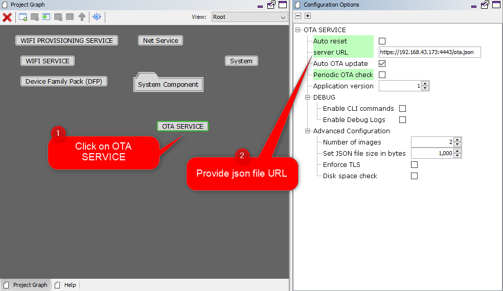

[](https://www.microchip.com)

# Over The Air (OTA) Programming Using Wi-Fi

This example application acts as a Wi-Fi Station(STA) to connect to Access point(AP) and perform OTA application update process to download an image present in the user defined OTA-HTTP server.

## Description

This application demonstrates how a user can perform OTA application upgrade using Wi-Fi. The user would need to configure the Home AP credentials (like SSID and security items). The Wi-Fi service will use the credentials to connect to the Home AP and acquire an IP address. Once the IP address is obtained application will perform OTA update process.


Application will try to connect with the defined server address and download the new image. The downloaded image will be stored in the external flash (sst26vf) initially. Application will reset the device to run new image once image is successfully downloaded from server. When device is reset ,bootloader will try to program the image from the external flash and if programming is successful ,downloaded image from the server will be executed . 

It is required to build "ota_bootloader" project located in the apps folder of `wireless_apps_pic32mzw1_wfi32e01` repo first before building this application as the image of the bootloader application will be used to integrate with the "wifi_ota_app_upgrade" application image. A unified hex file will be built using Hexmate tool and the unified HEX image will be loaded to the device. More details about this can be found in "Running Application" section below.

 This application uses File System, a harmony component which internally use SPI protocol to place the newly downloaded image to the external flash.


## OTA Application framework Architecture

Over the Air (OTA) firmware upgrade feature is designed with a two step process, Image Downloading and Image Programming process. Image Downloading process is done by `OTA SERVICE`, harmony componet and `ota_bootloader` will take care of programming process.

Abstraction model:


**User Application:** This is where the customer application logic is built.

**OTA Service:** This layer includes the service level logic implementation. This is a Harmony component which provides certain user configurable parameters(ex- Version, Periodic update check etc.) . Based on user configuration, generated code will be activated with required functionalities.


  

**OTA software platform / OTA Core :** This is the platform layer that consist of the main OTA logic implementation. When OTA process is triggered , this layer will communicate with the transport layer to connect to OTA server. If new image is available , it will initiate download using transport layer. If successfully downloaded, it will store the new image into the File System .

**File System :**  The architecture is designed to provide flexibility for the customer to choose the storage medium (ex- SST26 SPI flash, SD card, USB MSD in host mode etc.). Any medium supported by the Harmony3 file system can be used with the OTA service.

**Bootloader :** This layer consists of the logic to safely program images from the file system (external) into program the program memory (NVM) of the device. At device boot, the bootloader will check if a new image is available in the external image store and transfer it to the NVM.

For more details , Please follow documentation provided in [link](https://github.com/Microchip-MPLAB-Harmony/wireless_system_pic32mzw1_wfi32e01/tree/master/system/ota/docs)

## OTA server JSON manifest

The Application expects the HTTP based OTA server to provide metadata of images available in the server in `json` format. During update checks, the OTA service will download and parse this manifest file. Each entry in the manifest file should include the following fields :

- **`Version`** indicates the application version number. It is a integer value.

- **`URL`** contains the image path from which the application image can be downloaded. It is a string variable.

- **`Digest`**  contain the `SHA256` digest of image to be downloaded. It is a 64 byte string variable an should not include whitespaces

- **`EraseVer`** This ***optional*** field provides a capability to trigger an erase of an version which was downloaded earlier. Customer may want to remove an image from the image store due to various reason, application with bug, may be one of them. It is a bool variable. 

  - If user configures this field as "true", OTA serice will delete image version mentioned in "Version" field. 

  -  If user configures this field as "false", OTA service will follow image downwload logic.


**Sample JSON**

```json
    {
    
    "ota": [
            {
                "Version": 3,
                "URL": "http://192.168.43.173:8000/wifi_ota103.bin",
                "Digest": "745189cbb24b752a0175de1f9d5d61433ba47d89aff5b5a3686f54ca2d5dfb22",
                "EraseVer": false
            },
            {
                "Version": 6,
                "URL": "http://192.168.43.173:8000/wifi_ota100.bin",
                "Digest": "885189cbb24b7b1a0175deef9d5d61f53c247d89a095b5a3686f54ca2d5dfbaa",
                "EraseVer": false
            }
           ]
    }
```

OTA service will download json file from server first when update check process is triggered by application, try to fetch information and proceed further .

**For more details , Please follow documentation provided in [link](https://github.com/Microchip-MPLAB-Harmony/wireless_system_pic32mzw1_wfi32e01/tree/master/system/ota/docs)**

## OTA image generation

Please refer `Generating OTA image section` in `usage` manual present in [link](https://github.com/Microchip-MPLAB-Harmony/wireless_system_pic32mzw1_wfi32e01/tree/master/system/ota/docs)  

## Downloading and building the application

To download or clone this application from Github, go to the [top level of the repository](https://github.com/Microchip-MPLAB-Harmony/wireless_apps_pic32mzw1_wfi32e01)


Path of the application within the repository is **apps/wifi_ota_app_upgrade/firmware** .

To build the application, refer to the following table and open the project using its IDE.

| Project Name      | Description                                    |
| ----------------- | ---------------------------------------------- |
| pic32mz_w1_curiosity_freertos.X | MPLABX project for PIC32MZ W1 Curiosity Board |
|||

## Setting up PIC32MZ W1 Curiosity Board

- Connect the Debug USB port on the board to the computer using a micro USB cable
- On the GPIO Header (J207), connect U1RX (PIN 13) and U1TX (PIN 23) to TX and RX pin of any USB to UART converter
- Home AP (Wi-Fi Access Point with internet connection)
- HTTP server.
- python 3.9.0 .

## Running the Application


1.  Open the project "wifi_ota_app_upgrade".
2.	Demo is configured with the default wifi credentials shown in the image below. To change the configurations launch the Harmony 3 configurator and update the home AP credentials for STA Mode and generate code.

  

    

3. Configuring server url :
    

3.  As a part of OTA process device will try to connect to user defined HTTP server. If device is able to connect to server without any error, it will try to fetch json manifest information .
    - User can use any HTTP server.
    - User may also use python command to create a local http server using below steps:
                

      - Open command prompt and change driectory to the folder where ota image is present.

        

      - Use below python command in command prompt:
                        
        `python -m http.server 8000`    
                    
                    
         

    
5.  Generate the code using MHC.    

5.  To create factory reset image , It is required to integrate the bootloader and ota application image and create a single unified HEX file. To integrate 2 images we can use hexmate tool, which is readily available with MPLABX package as part of the standard installation. To combine the hex files -

    -  User should load the "ota_bootloader" project located in the  apps folder of "wireless_apps_pic32mzw1_wfi32e01" repo and include it into "wifi_ota_app_upgrade" project as a "Loadable" component. For this, right click on the "wifi_ota_app_upgrade" project, click on "properties" and  select "ota_bootloader" project. User need to make sure that the steps mentioned in "ota_bootloader" reference document is followed, before this step.

        

        

    -  Click on "Apply" button to make the applied changes effective:

        

6.  It is required to perform a "post-build" step to create ota image with file extension ".bin" (which can be placed in the server and downloaded during OTA process). 
    -   All required files for post-build process will be generated (during `step 5)`, mentioned above) automatically in "tools" folder, created inside project folder.

        

    -   Right click on the "wifi_ota_app_upgrade" project and click on properties.

        

    -   Select "building", insert below command and click "OK":

        `../../tools/hex2bin/hex2bin.exe`

        **Note**: python should be present in the system variable path.

        
    
        **For more details , Please follow documentation provided in [link](https://github.com/Microchip-MPLAB-Harmony/wireless_system_pic32mzw1_wfi32e01/tree/master/system/ota/docs)**         

7.  Build and program the application.

8.  Place the `.bin` image into the HTTP server. The `.bin` image can be found in below path which is generated during "wifi_ota_app_upgrade" project build :
  `..\firmware\wifi_ota_app_upgrade.X\dist\pic32mz_w1_curiosity_freertos\production` 

6.  Connect to a USB to UART converter to UART1 and Open a Terminal application (Ex.:Tera term) on the computer. Configure the serial settings as follows:
    - Baud : 115200
    - Data : 8 Bits
    - Parity : None
    - Stop : 1 Bit
    - Flow Control : None

7.	The device will connect to the Home AP and print the IP address obtained.

    

9.  Once IP address is obtained the device will initiate OTA process and try to fetch json manifest content, periodically for every 60 sec .

10. User should make sure that both HTTP server and the PIC32MZW1 device are part of same wifi network (or connected to same Home AP). 
    
11. User can see periodical messages as shown in belo screen shot :

    

11. Once image is downloaded successfully, the application will print a message in the console. User need to reset the device to load the new image.

    

12. If OTA upgrade fails, user need to reset the device to initiate OTA process again.


13. During reset, device will check if any newly downloaded image is available in the external flash(sst26vf):
    -   if yes, bootloader will program new image to program-flash area of the device from external flash.
        - if programming is successful bootloader will hand over control and application will start executing.
    -   if no new image is available then bootloader will hand over control without programming any image and application image already present in the program-flash area will start executing     
 

15. User will come to know if new image is running by checking the version number in console print 


