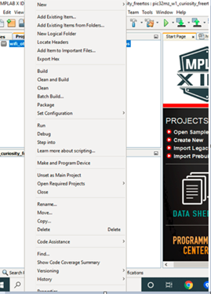

# Over The Air (OTA) Programming Using Wi-Fi

This example application acts as a Wi-Fi Station(STA) to connect to Access point(AP) and perform OTA application update process to download an image present in the HTTP server.

## Description

This application demonstrates how a user can perform OTA application upgrade using Wi-Fi. The user would need to configure the Home AP credentials (like SSID and security items). The Wi-Fi service will use the credentials to connect to the Home AP and acquire an IP address. Once the IP address is obtained application will perform OTA update process.

Application will try to connect with the defined server address and download the new image. The downloaded image will be stored in the external flash (sst26vf) initially. User need to reset the device to run new image once image is successfully downloaded from server. When device is reset bootloader will try to program the image from the external flash and if programming is successful ,downloaded image from the server will be executed . 

It is required to build "ota_bootloader" project located in the "wireless" apps folder of this repo first before building this application as the image of the bootloader application will be used to integrate with the "eifi_ota_app_upgrade" application image. A unified hex file will be built using Hexmate tool and the unified HEX image will be loaded to the device. More details about this can be found in "Running Application" section below.

 This application uses SPI protocol to place the newly downloaded image to the external flash. The External flash will be configured for 3 slots for storing upto 3 OTA images. Each slot is of size 832Kb. Each OTA image will also include header to maintain the image status. The default application will try to establish a connection to AP "DEMO_AP" with WPA2 security and password as a "password".

## OTA Application framework Architecture

Over the Air (OTA) firmware upgrade feature is designed with a two step process, Image Downloading and Image Programming process. Image Downloading process is now processed by the main application firmware.

Abstraction model:

- Application is responsible to start the OTA process by calling `OTA_start()` function to download the new image into the Image Store in the external flash (sst26vf).
- Image downloading is done through HTTP protocol.
- Bootloader is responsible for the programming process, which loads and copies the best image from Image Store to Program area and jumps to the Application. The bootloader also supports ‘Fail-Safe’ boot scheme which the firmware automatically rolls back if the image has not been run correctly at the previous boot.
- Image-Store in external flash (sst26vf) can have multiple images, including the default image for factory reset.

**Application Image Structure :**

OTA application image structure is organised as shown in below picture. Total application length includes header bytes as well. 

Bootloader copies `Application Image Length` bytes from Image-Store to Program-flash area.

**Application Header Structure :**

Every ota image includes a header to keep track of image status as shown in below table:

OTA application and bootloader maintains `IMAGE_HEADER_SIGNATURE` byte, which is of one byte, located at 4096th byte (the last byte on the sector, refer Application Image Structure above) on the image header. The value should contain the same with the status field on the top. This is to ensure sector image integrity. If values are different, it is suspected the power cut or unknown reboot happened during the sector programming and image in that particular slot is treated as invalid image.

- **order** - it will be incremented for every image downloaded using OTA. If this value reaches 15 and then OTA process downloads a new image , value will 1.

- **slot** - it will indicate the slot in the external flash where the image is located.
  - 0 for defual image
  - 1 for slot 1
  - 2 for slot 2 

OTA application follows below steps while downloading an image from HTTP server:  

1.  **Allocating slot**: When OTA process is initiated, the OTA framework  will try to allocate a slot for the new image in the external flash. This slot will either be a blank slot, the lowest ranked or invalidated application firmware image slot. The External flash will be configured for 3 slots for, storing upto 3 OTA images. Slot 0 is reserved for the factory image and can not be replaced with an image obtained through OTA process. Only slot 1 and slot 2 will be used for storing new OTA images. Application allocates the slots in sequential order, meaning ota image downloaded during first OTA process will be stored in slot1 and 2nd OTA image downloaded during 2nd OTA process will be stored in the slot2. If the highest slot (slot 2) is already filled with the latest OTA image and user initiates OTA in this situation again, then the slot1 will be allocated for the new OTA image.

    

2.  The transport layer (HTTP protocol) starts downloading the image.

3.  OTA framework verifies the image by checking the signature field once transport layer finished receiving all data. Signature is a SHA-256  hash. If the downloaded image is valid, the OTA framework updates “Boot-Control”-header, status field of the current application to “Disabled” 0xF0.

4.  The application will be notified about OTA process completion using user registered call-back function. If OTA download has successfully finished, the application must reset the system to start the programming process.

Flow Chart Of The Application:

## Downloading and building the application

To download or clone this application from Github, go to the [top level of the repository](https://github.com/Microchip-MPLAB-Harmony/wireless_apps_pic32mzw1_wfi32e01)

Path of the application within the repository is **apps/wifi_ota_app_upgrade/firmware** .

To build the application, refer to the following table and open the project using its IDE.

| Project Name      | Description                                    |
| ----------------- | ---------------------------------------------- |
| pic32mz_w1_curiosity_freertos.X | MPLABX project for PIC32MZ W1 Curiosity Board |
|||

## Setting up PIC32MZ W1 Curiosity Board

- Connect the Debug USB port on the board to the computer using a micro USB cable
- On the GPIO Header (J207), connect U1RX (PIN 13) and U1TX (PIN 23) to TX and RX pin of any USB to UART converter
- Home AP (Wi-Fi Access Point with internet connection)
- HTTP server.
- python 3.9.0 .

## Running the Application

1.  Open the project "wifi_ota_app_upgrade".
2.	Demo is configured with the default wifi credentials shown in the image below. To change the configurations launch the Harmony 3 configurator and update the home AP credentials for STA Mode and generate code.

  

    

3.  As a part of OTA process device will try to connect to user defined HTTP server. If device is able to connect to server without any error, it will try to download the image ".ota" (image name should be defined correctly by user).
    - User can use any HTTP server.
    - User may also use python command to create a local http server using below steps:
                

      - Open command prompt and change driectory to the folder where ota image is present.

        

      - Use below python command in command prompt:
                        
        `python -m http.server 8000`    
                    
                    
         

3.  Configure HTTP server address and ota image name in "app.h" file using macro "#define SYS_OTA_URL".

    

4.  User need to disable "Add linker file" option to exclude MHC generated default linker file, and add the required custom linker file present in path `..\wifi_ota_app_upgrade\firmware\src\ota`

    

    

    

    
5.  Generate the code using MHC.    

5.  It is required to integrate the bootloader and ota application image and create a single unified HEX file. To integrate 2 images we can use hexmate tool, which is readily available with MPLABX package as part of the standard installation. To combine the hex files -

    -  User should load the "ota_bootloader" project located in the "wireless" apps folder of this repo and include it into "wifi_ota_app_upgrade" project as a "Loadable" component. For this, right click on the "wifi_ota_app_upgrade" project, click on "properties" and  select "ota_bootloader" project. User need to make sure that the steps mentioned in "ota_bootloader" reference document is followed, before this step.

        

        

    -  Click on "Apply" button to make the applied changes effective:

        

6.  It is required to perform a "post-build" step to create ota image with file extension ".ota" (which can be placed in the server and downloaded during OTA process) and factory reset image. During "post-build" a defined header will be included to the image using python script.
    -   All required files for post-build process are present in "utilities" folder which is present in the path **apps/wifi_ota_app_upgrade/**.
    -   Right click on the "wifi_ota_app_upgrade" project and click on properties.

        

    -   Select "building", insert below command and click "OK":

        `python ../../utilities/pic32mzw1/ota/post_process.py -d ${Device} -p ${ProjectDir} -c ${ConfName} -i ${ImagePath} ${ImageDir} ${ImageName} ${IsDebug}`

        **Note**: python should be present in the system variable path.

        
    
    -   User can download any valid binary or hex image. ( Not necessary to be image with ".ota" extension )        

7.  Build and program the application.

8.  Place the `.ota` image into the HTTP server. The `.ota` image can be found in below path which is generated during "wifi_ota_app_upgrade" project build :
  `..\firmware\wifi_ota_app_upgrade.X\dist\pic32mz_w1_curiosity_freertos\production` 

6.  Connect to a USB to UART converter to UART1 and Open a Terminal application (Ex.:Tera term) on the computer. Configure the serial settings as follows:
    - Baud : 230400
    - Data : 8 Bits
    - Parity : None
    - Stop : 1 Bit
    - Flow Control : None

7.	The device will connect to the Home AP and print the IP address obtained.

    

8.	From the DUT(Device Under Test), user can ping the Gateway IP address.

    
9.  Once IP address is obtained the device will initiate OTA process.

10. User should make sure that both HTTP server and the PIC32MZW1 device are part of same wifi network (or connected to same Home AP).

    
11. Once image is downloaded successfully, the application will print a message in the console. User need to reset the device to load the new image.

    

12. If OTA upgrade fails, user need to reset the device to initiate OTA process again.

    

13. During reset, device will check if any newly downloaded image is available in the external flash(sst26vf):
    -   if yes, bootloader will program new image to program-flash area of the device from external flash.
        - if programming is successful bootloader will hand over control and application will start executing.
    -   if no new image is available then bootloader will hand over control without programming any image and application image already present in the program-flash area will start executing     

14. If any new image is available in external flash bootloader will try to program the new image. During programming if bootloader finds that the image is not valid (based on certain criteria, check "ota_bootloader" project reference for more details) then , bootloader will stop programming that particular image and check for other highest ranked (check "ota_bootloader" project reference for more details) valid image prepsent in the external flash and start programming it. Once programming is completed successfully , bootloader will hand over control and application will start executing.  

15. User will come to know if new image is running by checking the slot number in console print ( as mention above under  "Application Header Structure"- topic )

