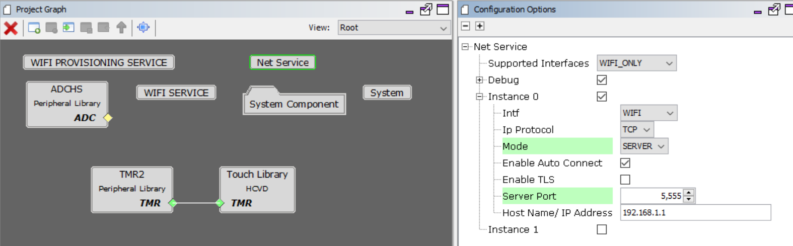
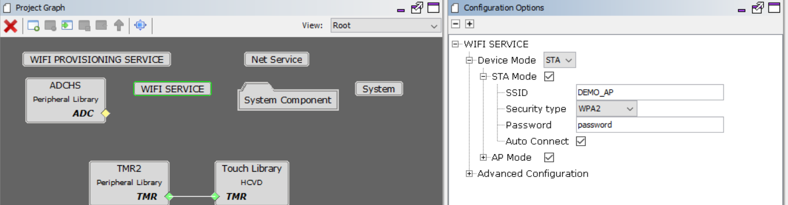
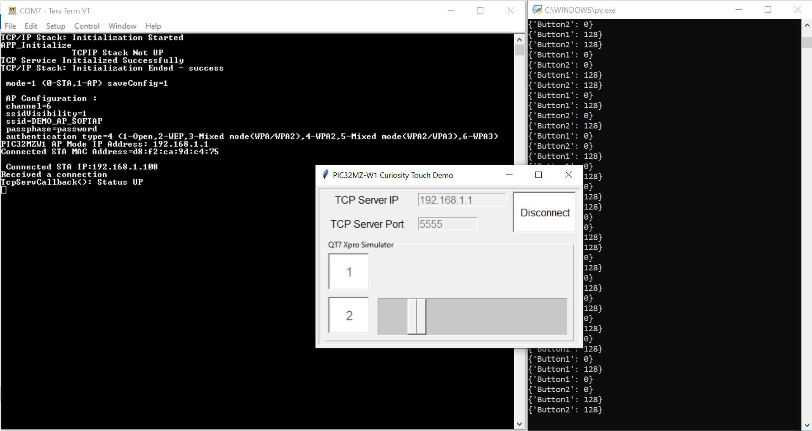
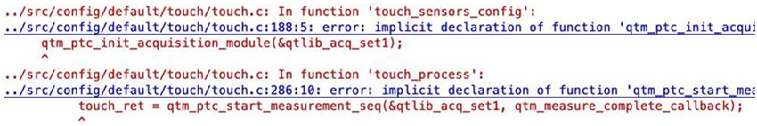

# Wi-Fi Touch Demo

This example application acts as a TCP Server to which a TCP Client can connect and visualize QT7 Touch Xpro data.

## Description

This application demonstrates how a user can implement a Wi-Fi based Touch application using PIC32MZ-W1's internal hardware CVD Controller and QT7 Xplained Pro self-capacitance touch evaluation kit. This demo will start a TCP server on the device which is running in STA Mode. The user would need to configure the Wi-Fi settings for the target AP and the port number at which the TCP server would be started. The Application will come up as a Wi-Fi STA and wait for a valid IP address to be obtained. Afterwards the TCP Server will start running on it. A python script to emulate a dummy TCP client is provided which will display real-time sensor operations on QT7 Xpro board.

## Downloading and building the application

To download or clone this application from Github, go to the [top level of the repository](https://github.com/Microchip-MPLAB-Harmony/wireless_apps_pic32mzw1_wfi32e01)

Path of the application within the repository is **apps/wifi_touch_demo/firmware** .

To build the application, refer to the following table and open the project using its IDE.

| Project Name      | Description                                    |
| ----------------- | ---------------------------------------------- |
| pic32mz_w1_curiosity_qt7.X | MPLABX project for PIC32MZ W1 Curiosity Board |
|||

## Setting up PIC32MZ W1 Curiosity Board

- Connect a programmer tools such as SNAP, ICD4, etc to ICSP header.
- On the GPIO Header (J207), connect U1RX (PIN 13) and U1TX (PIN 23) to TX and RX pin of any USB to UART converter
- Laptop/ Mobile (to run the TCP Client on it)
- Jumper J211 is connected between pins 2-3 (closer to xpro header)
- Jumper J209 is disconnected
- Jumpers J301 are disconnected (to use external programmer tool)
- QT7 Xpro board is connected to Curiosity Xpro header

## Running the Application

1. Open the project and launch Harmony3 configurator.
2.	Currently Net Service is configured to run as TCP Server running on port **5555**. In case the user wants to change this config, please make the changes in the Net Service Module as shown below:

3. Configure the Wi-Fi Service STA mode as per your target AP parameters:

4.	Save configurations and generate code via MHC 
5.	Build and program the generated code into the hardware using its IDE
6. Open the Terminal application (Ex.:Tera term) on the computer
7. Connect to the "USB to UART" COM port and configure the serial settings as follows:
    - Baud : 115200
    - Data : 8 Bits
    - Parity : None
    - Stop : 1 Bit
    - Flow Control : None

8.	The device shall come up as STA and then as per the Net Service configuration, the TCP Server shall come up, awaiting a connection from a TCP Client.

9.	Connect a Laptop to the same AP and run the provided python script. (tested with Python v3.8 and Windows 10)
10. Connect the python client giving the server IP as the IP of the Board, and the port as 5555. All operations from the QT7 Xpro board will now be visible real-time on the GUI:

## Known Issues:

While regenerating the code using MHC, make sure not to overwrite following two functions in **touch.c**.

These are generating as qtm_**ptc**_ while they should be qtm_**cvd**_  causing build issues. Simply changing the function to qtm_**cvd**_ resolves the issue.

